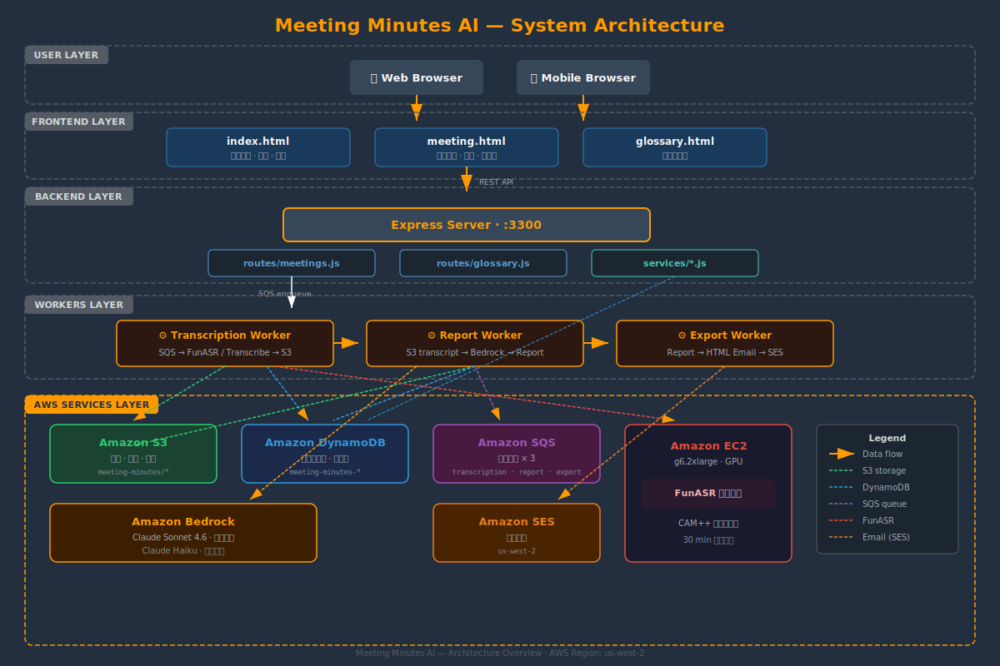

# Meeting Minutes AI

> 基于 Amazon Bedrock + FunASR 的智能会议纪要系统
>
> 上传音频 → 语音转录 → AI 生成结构化纪要 → 邮件发送


## 功能特性

- **多格式音频上传** — 支持 MP4 / MP3 / M4A / OGG，拖拽上传
- **双引擎转录** — FunASR（GPU 加速 + CAM++ 说话人分离）/ Amazon Transcribe 并行转录
- **AI 结构化纪要** — Claude Sonnet 4.6 自动提取摘要、待办、关键决策、风险、参会人
- **多会议类型模板** — 通用 / 周会 / 技术评审 / 客户会议，各有专属报告结构
- **自动命名** — Claude Haiku 根据摘要生成语义化标题
- **说话人重命名** — speakerMap 映射，重命名后可一键重新生成报告
- **词汇表管理** — 维护专业术语和联系人，辅助转录和报告质量
- **报告内联编辑** — 直接在页面修改摘要、待办、决策等字段
- **邮件发送** — Amazon SES 发送 HTML 格式会议纪要邮件
- **多会议合并报告** — 选择 2-10 个已完成会议，合并生成综合报告
- **GPU 自动休眠** — FunASR EC2 实例 30 分钟无任务自动关机，节省成本
- **移动端响应式** — 适配手机浏览器的完整操作体验

## 架构



### 技术栈

| 层级 | 技术 | 说明 |
|------|------|------|
| 前端 | HTML / CSS / JavaScript | 原生实现，Cloudscape 设计风格 |
| 后端 | Node.js + Express | REST API，端口 3300 |
| AI 模型 | Amazon Bedrock (Claude Sonnet 4.6) | 报告生成 + 自动命名 |
| 转录引擎 | FunASR (EC2 g6.2xlarge GPU) | CAM++ 说话人分离，按需启停 |
| 转录引擎 | Amazon Transcribe | 备选转录通道 |
| 数据库 | Amazon DynamoDB | 会议元数据 + 词汇表存储 |
| 对象存储 | Amazon S3 | 音频文件 / 转录结果 / 报告 JSON |
| 消息队列 | Amazon SQS | 转录 / 报告 / 导出三条独立队列 |
| 邮件 | Amazon SES (us-west-2) | HTML 格式会议纪要邮件 |
| 安全 | Helmet + CORS | CSP 策略，禁止内联脚本 |

### 数据流

1. 用户通过 Web UI 上传音频文件（支持拖拽）
2. Express 接收文件，上传至 S3，在 DynamoDB 创建会议记录
3. 发送转录任务消息到 SQS Transcription Queue
4. **Transcription Worker** 轮询队列，调用 FunASR / Amazon Transcribe 进行转录
5. 转录结果（含说话人标签）存入 S3，发送消息到 Report Queue
6. **Report Worker** 读取转录文本 + 词汇表，调用 Bedrock Claude 生成结构化报告
7. 报告 JSON 存入 S3，更新 DynamoDB 状态为已完成
8. 用户查看报告，可编辑、重命名说话人、重新生成
9. 用户触发发邮件，消息进入 Export Queue
10. **Export Worker** 读取报告，渲染 HTML 邮件，通过 SES 发送

## 快速开始

### 环境要求

- Node.js >= 18
- AWS 账号，配置好 CLI 凭证（`~/.aws/credentials`）
- 已创建的 AWS 资源：S3 Bucket、DynamoDB Table、SQS Queues、SES 验证域名

### 配置

```bash
cp .env.example .env
```

编辑 `.env` 文件：

| 变量 | 说明 | 示例 |
|------|------|------|
| `AWS_REGION` | AWS 区域 | `us-west-2` |
| `S3_BUCKET` | S3 存储桶名称 | `my-bucket` |
| `S3_PREFIX` | S3 前缀路径 | `meeting-minutes` |
| `DYNAMODB_TABLE` | 会议表名 | `meeting-minutes-meetings` |
| `GLOSSARY_TABLE` | 词汇表名 | `meeting-minutes-glossary` |
| `SQS_TRANSCRIPTION_QUEUE` | 转录队列 URL | SQS 完整 URL |
| `SQS_REPORT_QUEUE` | 报告队列 URL | SQS 完整 URL |
| `SQS_EXPORT_QUEUE` | 导出队列 URL | SQS 完整 URL |
| `SES_FROM_EMAIL` | 发件人邮箱 | `noreply@example.com` |
| `SES_TO_EMAIL` | 收件人邮箱 | `team@example.com` |
| `PORT` | 服务端口 | `3300` |
| `FUNASR_INSTANCE_ID` | FunASR EC2 实例 ID | `i-0xxxxx` |
| `FUNASR_URL` | FunASR 服务地址（可选） | `http://host:port` |
| `ENABLE_TRANSCRIBE` | 启用 AWS Transcribe（可选） | `true` / `false` |
| `ENABLE_WHISPER` | 启用 Whisper（可选） | `true` / `false` |

### 启动

```bash
# 安装依赖
npm install

# 启动 API 服务
npm start

# 分别启动三个 Worker（各开一个终端）
npm run worker:transcription
npm run worker:report
npm run worker:export
```

服务启动后访问 http://localhost:3300

## API 文档

### 会议 API

| Method | Path | Description |
|--------|------|-------------|
| `GET` | `/api/meetings` | 获取会议列表（自动按 meetingId 去重） |
| `POST` | `/api/meetings` | 创建会议记录 |
| `GET` | `/api/meetings/:id` | 获取会议详情（含 S3 报告内容） |
| `PUT` | `/api/meetings/:id` | 更新会议元数据 |
| `DELETE` | `/api/meetings/:id` | 删除会议 |
| `POST` | `/api/meetings/upload` | 上传音频文件并入队转录（multipart/form-data） |
| `POST` | `/api/meetings/:id/retry` | 重试失败的转录/报告任务 |
| `POST` | `/api/meetings/:id/regenerate` | 使用当前 speakerMap 重新生成报告 |
| `PUT` | `/api/meetings/:id/speaker-names` | 保存说话人映射（不触发重新生成） |
| `PATCH` | `/api/meetings/:id/report` | 编辑报告指定字段（summary / actionItems / keyDecisions） |
| `POST` | `/api/meetings/:id/auto-name` | AI 自动生成会议标题 |
| `POST` | `/api/meetings/:id/send-email` | 触发邮件发送 |
| `POST` | `/api/meetings/merge` | 合并多个会议生成综合报告（2-10 个） |

### 词汇表 API

| Method | Path | Description |
|--------|------|-------------|
| `GET` | `/api/glossary` | 获取所有词汇 |
| `POST` | `/api/glossary` | 新增词汇（term / definition / aliases） |
| `PUT` | `/api/glossary/:id` | 更新词汇 |
| `DELETE` | `/api/glossary/:id` | 删除词汇 |

### 健康检查

| Method | Path | Description |
|--------|------|-------------|
| `GET` | `/api/health` | 服务健康检查，返回 `{status: "ok"}` |

## Workers 说明

### Transcription Worker

- **职责**：轮询 SQS 转录队列，调用转录引擎处理音频
- **触发**：上传音频或点击重试时，消息进入 SQS Transcription Queue
- **转录通道**：FunASR（GPU，说话人分离）、Amazon Transcribe、Whisper HTTP — 可独立启用，并行执行
- **输出**：转录 JSON 存入 S3 `transcripts/{meetingId}/` 目录
- **错误处理**：单通道失败不影响其他通道；全部失败则标记会议为 `failed`，记录 errorMessage

### Report Worker

- **职责**：读取转录文本，调用 Bedrock Claude 生成结构化报告
- **触发**：Transcription Worker 完成后发送消息到 Report Queue
- **流程**：拉取转录 + 词汇表 → 按会议类型选择 prompt 模板 → 调用 Bedrock → 解析 JSON → 存 S3
- **错误处理**：失败标记为 `failed`，消息留在 SQS 等待可见性超时后重试

### Export Worker

- **职责**：渲染 HTML 邮件并通过 SES 发送
- **触发**：用户在 UI 手动点击"发送邮件"按钮
- **输出**：Cloudscape 风格 HTML 邮件，包含完整报告内容（按会议类型渲染不同模块）
- **错误处理**：失败标记为 `failed`，记录 errorMessage

## 项目结构

```
meeting-minutes/
├── server.js                     # Express 入口，路由注册 + Helmet CSP
├── package.json
├── .env.example                  # 环境变量模板
├── db/
│   └── dynamodb.js               # DynamoDB 客户端初始化
├── routes/
│   ├── meetings.js               # 会议 CRUD + 转录 + 报告 API
│   └── glossary.js               # 词汇表管理 API
├── services/
│   ├── bedrock.js                # Bedrock Claude 报告生成
│   ├── s3.js                     # S3 文件操作
│   ├── ses.js                    # SES 邮件发送
│   ├── sqs.js                    # SQS 消息收发
│   └── gpu-autoscale.js          # GPU 实例自动休眠
├── workers/
│   ├── transcription-worker.js   # 转录 Worker
│   ├── report-worker.js          # 报告生成 Worker
│   └── export-worker.js          # 邮件导出 Worker
├── public/
│   ├── index.html                # 会议列表页
│   ├── meeting.html              # 会议详情页
│   ├── glossary.html             # 词汇表管理页
│   ├── js/
│   │   └── app.js                # 前端逻辑
│   └── css/
│       ├── style.css             # Cloudscape 风格样式
│       └── font-awesome.min.css  # 图标库
├── tests/                        # Jest 单元测试
├── scripts/
│   └── upload_meeting.py         # CLI 上传脚本
└── assets/
    └── architecture.svg          # 架构图
```

## 安全说明

- **CSP 策略** — Helmet 配置严格 Content-Security-Policy：禁止内联脚本，只允许同源 JS 文件；禁止外部 CDN 加载
- **CORS** — 限制为 localhost 和内网 IP，不开放公网跨域
- **输入校验** — 文件上传限制格式（audio/video MIME）和大小；API 参数校验
- **SQS 幂等** — Worker 处理消息后删除，可见性超时保证不会重复处理
- **凭证管理** — AWS 凭证通过 IAM Role / 环境变量传递，不硬编码

## License

MIT
