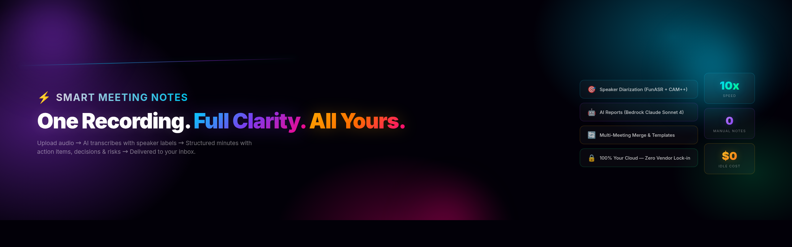

# Smart Meeting Notes

AI-powered meeting minutes: upload audio, get structured reports with action items, decisions, and speaker attribution.

Upload a recording of any meeting and Smart Meeting Notes will automatically transcribe it with speaker labels, generate a structured AI report, and deliver polished meeting minutes to your inbox -- no manual note-taking required.

## Features

- **Multi-format audio upload** -- MP4, MP3, M4A, OGG, and WAV with drag-and-drop support
- **Dual-engine transcription** -- FunASR (GPU-accelerated, with CAM++ speaker diarization) and Amazon Transcribe as a managed alternative
- **AI report generation** -- Amazon Bedrock Claude Sonnet 4 extracts summary, action items, decisions, highlights, and risks
- **Multiple meeting templates** -- General, Weekly Standup, Tech Review, and Customer Meeting, each with tailored report sections
- **Meeting merge** -- combine 2-10 meetings into a single consolidated report
- **Auto-naming** -- Claude Haiku generates semantic meeting titles from transcript content
- **Speaker mapping** -- rename raw speaker labels (SPEAKER_0 -> John) and regenerate reports with real names
- **Glossary management** -- maintain domain terms and contact names to improve transcription accuracy and report quality
- **Inline report editing** -- modify any section directly in the browser
- **Email delivery** -- HTML-formatted meeting minutes via Amazon SES
- **GPU auto-hibernate** -- FunASR EC2 instance auto-stops after 30 minutes idle to reduce costs
- **Mobile responsive UI** -- Cloudscape-inspired design that works on desktop and mobile

## Architecture

```
Browser (HTML / CSS / JS)
    |
    v
Express API (port 3300)
    |
    +---> S3 (audio files, transcripts, reports)
    +---> DynamoDB (meeting metadata, glossary)
    +---> SQS (3 queues: transcription, report, export)
    |
Workers (3 independent Node.js processes)
    |
    +---> Transcription Worker ---> FunASR (GPU EC2) / AWS Transcribe
    +---> Report Worker ---------> Amazon Bedrock Claude
    +---> Export Worker ----------> Amazon SES
```

**Data flow:**

1. User uploads audio. File goes to S3, metadata to DynamoDB, job message to SQS.
2. Transcription worker picks up the job, sends audio to FunASR (or Transcribe), stores the transcript in S3.
3. Report worker reads the transcript and glossary, calls Bedrock Claude, stores the structured report in S3 and DynamoDB.
4. User views and edits the report in the browser. Speaker names can be remapped and the report regenerated.
5. Export worker renders the report as HTML and sends it via SES.

**Status flow:** `pending -> processing -> transcribed -> reported -> done` (any step can transition to `failed`).

## Tech Stack

| Layer          | Technology                                                     |
| -------------- | -------------------------------------------------------------- |
| Frontend       | HTML / CSS / JavaScript (Cloudscape design style)              |
| Backend        | Node.js + Express (CommonJS)                                   |
| AI             | Amazon Bedrock (Claude Sonnet 4 for reports, Haiku for naming) |
| Transcription  | FunASR with CAM++ speaker diarization (GPU EC2)                |
| Database       | Amazon DynamoDB                                                |
| Storage        | Amazon S3                                                      |
| Queue          | Amazon SQS (3 queues)                                          |
| Email          | Amazon SES                                                     |
| Security       | Helmet CSP + CORS + Zod validation + rate limiting             |

## Quick Start

### Prerequisites

- Node.js >= 18
- AWS account with CLI credentials configured
- AWS resources: S3 bucket, DynamoDB tables, SQS queues, SES verified domain

### Option A: CloudFormation (Recommended)

```bash
# 1. Deploy AWS resources
aws cloudformation deploy \
  --template-file infrastructure/cloudformation.yaml \
  --stack-name smart-meeting-notes \
  --capabilities CAPABILITY_IAM

# 2. Get outputs
aws cloudformation describe-stacks \
  --stack-name smart-meeting-notes \
  --query 'Stacks[0].Outputs'

# 3. Configure
cp .env.example .env
# Edit .env with values from CloudFormation outputs

# 4. Install and start
npm install
npm start

# 5. Start workers (each in a separate terminal)
npm run worker:transcription
npm run worker:report
npm run worker:export
```

### Option B: Docker

```bash
cp .env.example .env
# Edit .env with your AWS configuration

docker compose up
```

Then visit **http://localhost:3300**.

## Configuration

Copy `.env.example` to `.env` and set the following variables:

| Variable                   | Description                                 | Example                                   |
| -------------------------- | ------------------------------------------- | ----------------------------------------- |
| `PORT`                     | Server port                                 | `3300`                                    |
| `API_KEY`                  | API key for authentication                  | `your-secret-api-key`                     |
| `AWS_REGION`               | AWS region for all services                 | `us-west-2`                               |
| `S3_BUCKET`                | S3 bucket name                              | `smart-meeting-notes-bucket`              |
| `S3_PREFIX`                | Key prefix inside the bucket                | `meeting-minutes/`                        |
| `DYNAMODB_TABLE`           | DynamoDB table for meetings                 | `smart-meeting-notes-meetings`            |
| `GLOSSARY_TABLE`           | DynamoDB table for glossary terms           | `smart-meeting-notes-glossary`            |
| `SQS_TRANSCRIPTION_QUEUE`  | SQS queue URL for transcription jobs        | `https://sqs.us-west-2.amazonaws.com/...` |
| `SQS_REPORT_QUEUE`         | SQS queue URL for report generation jobs    | `https://sqs.us-west-2.amazonaws.com/...` |
| `SQS_EXPORT_QUEUE`         | SQS queue URL for email export jobs         | `https://sqs.us-west-2.amazonaws.com/...` |
| `BEDROCK_MODEL_ID`         | Bedrock model for report generation         | `anthropic.claude-sonnet-4-20250514`      |
| `BEDROCK_HAIKU_MODEL_ID`   | Bedrock model for auto-naming               | `anthropic.claude-3-5-haiku-20241022`     |
| `FUNASR_HOST`              | FunASR server host                          | `172.31.27.101`                           |
| `FUNASR_PORT`              | FunASR server port                          | `9002`                                    |
| `FUNASR_INSTANCE_ID`       | EC2 instance ID for GPU auto-hibernate      | `i-0abcdef1234567890`                     |
| `SES_FROM_EMAIL`           | Verified SES sender email address           | `meetings@example.com`                    |
| `SES_REGION`               | SES region (must match verified identity)   | `us-west-2`                               |
| `NODE_ENV`                 | Environment                                 | `production`                              |

## Project Structure

```
smart-meeting-notes/
├── server.js                     # Express entry point
├── middleware/
│   └── auth.js                   # API key authentication
├── routes/
│   ├── meetings/                 # Meeting endpoints
│   │   ├── index.js              #   Router aggregator
│   │   ├── core.js               #   CRUD, upload, retry, auto-name
│   │   ├── report.js             #   Report generation, PATCH, speaker mapping, merge
│   │   ├── email.js              #   Email sending
│   │   └── helpers.js            #   Shared route utilities
│   └── glossary.js               # Glossary management
├── services/
│   ├── meeting-store.js          # DynamoDB meeting operations
│   ├── glossary-store.js         # DynamoDB glossary operations
│   ├── bedrock.js                # Bedrock Claude invocation + prompt templates
│   ├── report-builder.js         # Report construction logic
│   ├── report-speaker-normalizer.js  # Speaker name normalization
│   ├── s3.js                     # S3 file operations
│   ├── sqs.js                    # SQS send / receive / delete
│   ├── ses.js                    # SES email sending
│   ├── gpu-autoscale.js          # FunASR EC2 auto-hibernate
│   ├── ffmpeg.js                 # Audio format conversion
│   └── logger.js                 # Centralized logger
├── workers/
│   ├── transcription-worker.js   # SQS -> FunASR / Transcribe -> S3
│   ├── report-worker.js          # SQS -> Bedrock Claude -> S3 + DynamoDB
│   └── export-worker.js          # SQS -> HTML render -> SES
├── public/                       # Frontend (static HTML / CSS / JS)
│   ├── index.html                # Meeting list page
│   ├── meeting.html              # Meeting detail page
│   ├── glossary.html             # Glossary management page
│   ├── js/app.js                 # Frontend application logic
│   └── css/style.css             # Cloudscape-style theme
├── funasr-server.py              # FunASR GPU server (deploy to EC2)
├── infrastructure/               # CloudFormation templates
├── docs/                         # Deployment and setup guides
├── tests/                        # Jest unit tests
├── e2e/                          # Playwright E2E tests
└── scripts/                      # CLI utilities
```

## API Reference

All endpoints require the `x-api-key` header unless noted otherwise.

### Meetings

| Method   | Endpoint                                | Description                        |
| -------- | --------------------------------------- | ---------------------------------- |
| `GET`    | `/api/meetings`                         | List meetings (paginated)          |
| `GET`    | `/api/meetings/:id`                     | Get meeting by ID                  |
| `POST`   | `/api/meetings/upload`                  | Upload audio file                  |
| `DELETE` | `/api/meetings/:id`                     | Delete a meeting                   |
| `POST`   | `/api/meetings/:id/regenerate`          | Regenerate report                  |
| `POST`   | `/api/meetings/:id/auto-name`           | Auto-generate meeting title        |
| `PATCH`  | `/api/meetings/:id/report`              | Update a report section            |
| `PUT`    | `/api/meetings/:id/speaker-names`       | Update speaker name mappings       |
| `POST`   | `/api/meetings/:id/email`              | Send meeting minutes via email     |
| `POST`   | `/api/meetings/merge`                   | Merge multiple meetings            |

### Glossary

| Method   | Endpoint                                | Description                        |
| -------- | --------------------------------------- | ---------------------------------- |
| `GET`    | `/api/glossary`                         | List glossary terms                |
| `POST`   | `/api/glossary`                         | Add a glossary term                |
| `PUT`    | `/api/glossary/:id`                     | Update a glossary term             |
| `DELETE` | `/api/glossary/:id`                     | Delete a glossary term             |

### System

| Method   | Endpoint                                | Description                        |
| -------- | --------------------------------------- | ---------------------------------- |
| `GET`    | `/health`                               | Health check                       |

Error responses follow a consistent format:

```json
{ "error": { "code": "MEETING_NOT_FOUND", "message": "Meeting does not exist" } }
```

## Documentation

- [Deployment Guide](docs/deployment-guide.md) -- Full AWS setup instructions
- [FunASR Setup](docs/funasr-setup.md) -- GPU transcription server configuration

## Development

```bash
# Install dependencies
npm install

# Run unit tests (550+ tests)
npm test

# Run linter
npm run lint

# Run E2E tests (requires a running server)
npm start &
npx playwright test e2e/

# Run a single test file
npx jest tests/meeting-store.test.js
```

Each worker runs as an independent process and polls its SQS queue:

```bash
npm run worker:transcription   # Terminal 1
npm run worker:report          # Terminal 2
npm run worker:export          # Terminal 3
```

## Contributing

Contributions are welcome. To get started:

1. Fork the repository.
2. Create a feature branch: `git checkout -b feature/your-feature`.
3. Make your changes and add tests.
4. Run the full test suite: `npm test && npm run lint`.
5. Commit with a clear message: `git commit -m "feat(scope): description"`.
6. Push and open a pull request against `main`.

Please follow the existing code style: ESLint + Prettier (single quotes, no semicolons, 100-char line width). All API input must be validated with Zod schemas. Use the centralized logger (`services/logger.js`) -- never `console.log` in production code.

## License

Apache License 2.0. See the [LICENSE](LICENSE) file for details.
