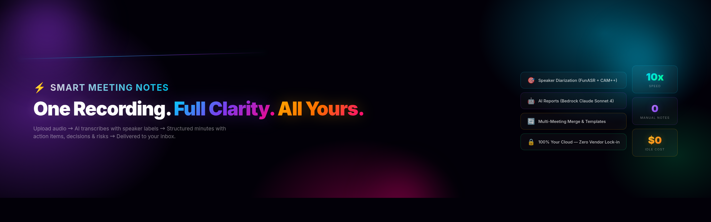

# Smart Meeting Notes

[English](#english) | [中文](#中文)

---

<a id="english"></a>

## English

AI-powered meeting minutes: upload audio, get structured reports with action items, decisions, and speaker attribution.

Upload a recording of any meeting and Smart Meeting Notes will automatically transcribe it with speaker labels, generate a structured AI report, and deliver polished meeting minutes to your inbox -- no manual note-taking required.

### Features

- **Multi-format audio upload** -- MP4, MP3, M4A, OGG, and WAV with drag-and-drop support
- **GPU-accelerated transcription** -- FunASR (Paraformer + VAD) with CAM++ speaker diarization
- **AI report generation** -- Amazon Bedrock Claude Opus extracts summary, action items, decisions, highlights, and risks
- **Multiple meeting templates** -- General, Weekly Standup, Tech Review, Customer Meeting, and Interview, each with tailored report sections (Interview includes LP assessment and hire recommendation)
- **Chunked weekly generation** -- 3-phase report generation for weekly meetings to avoid token-repetition hallucination
- **Multi-file upload and merge** -- upload multiple audio segments or combine 2-10 meetings into a consolidated report
- **Auto-naming** -- Claude Haiku generates semantic meeting titles from transcript content
- **Speaker mapping, roster, and pruning** -- rename speaker labels (SPEAKER_0 -> John), manage aliases, track speaker history, and auto-drop diarization noise speakers before Bedrock
- **Glossary with categories** -- maintain domain terms and contact names with per-meetingType category filtering to improve accuracy without prompt bloat
- **Inline report editing** -- modify any section directly in the browser, with edit/delete/add for all meeting types
- **Email delivery** -- HTML-formatted meeting minutes via Amazon SES
- **GPU auto-hibernate** -- FunASR EC2 instance auto-stops after 30 minutes idle to reduce costs
- **Mobile responsive UI** -- Cloudscape-inspired design that works on desktop and mobile

### Architecture

```
Browser (HTML / CSS / JS)
    |
    v
Express API (port 3300)
    |
    +---> S3 (audio files, transcripts, reports)
    +---> DynamoDB (meeting metadata, glossary)
    +---> SQS (3 queues: transcription, report, export)
    |
Workers (3 independent Node.js processes)
    |
    +---> Transcription Worker ---> FunASR (GPU EC2)
    +---> Report Worker ---------> Amazon Bedrock Claude
    +---> Export Worker ----------> Amazon SES
```

**Data flow:**

1. User uploads audio. File goes to S3, metadata to DynamoDB, job message to SQS.
2. Transcription worker picks up the job, sends audio to FunASR, stores the transcript in S3.
3. Report worker reads the transcript and glossary, calls Bedrock Claude, stores the structured report in S3 and DynamoDB.
4. User views and edits the report in the browser. Speaker names can be remapped and the report regenerated.
5. Export worker renders the report as HTML and sends it via SES.

**Status flow:** `pending -> processing -> transcribed -> reported -> done` (any step can transition to `failed`).

### Tech Stack

| Layer          | Technology                                                     |
| -------------- | -------------------------------------------------------------- |
| Frontend       | HTML / CSS / JavaScript (Cloudscape design style)              |
| Backend        | Node.js + Express (CommonJS)                                   |
| AI             | Amazon Bedrock (Claude Opus for reports, Haiku for naming)     |
| Transcription  | FunASR with CAM++ speaker diarization (GPU EC2)                |
| Database       | Amazon DynamoDB                                                |
| Storage        | Amazon S3                                                      |
| Queue          | Amazon SQS (3 queues)                                          |
| Email          | Amazon SES                                                     |
| Security       | Helmet CSP + CORS + Zod validation + rate limiting             |

### Project Structure

```
meeting-minutes/
├── server.js                     # Express entry point (port 3300)
├── funasr-server.py              # Flask ASR server (deploy to GPU EC2)
├── middleware/
│   └── auth.js                   # Optional x-api-key / Bearer auth
├── routes/
│   ├── meetings/
│   │   ├── index.js              #   Router aggregator + param validation
│   │   ├── core.js               #   CRUD, upload, upload-multiple, retry
│   │   ├── report.js             #   Regenerate, PATCH sections, speaker names, merge, auto-name
│   │   ├── email.js              #   Trigger email export
│   │   └── helpers.js            #   Multer setup, shared helpers
│   └── glossary.js               # Glossary CRUD + category filter
├── services/
│   ├── meeting-store.js          # DynamoDB meetings (Query via GSI, no Scan)
│   ├── glossary-store.js         # DynamoDB glossary
│   ├── glossary-filter.js        # Filter glossary by meetingType category
│   ├── glossary-prompt-builder.js # Structured Markdown glossary prompt
│   ├── bedrock.js                # Bedrock Claude invocation + prompt templates
│   ├── report-builder.js         # Single-shot report construction
│   ├── report-chunked.js         # 3-phase chunked generation for weekly meetings
│   ├── report-speaker-normalizer.js  # Normalize speaker names in report
│   ├── report-post-processor.js  # Glossary + speaker post-processing
│   ├── speaker-roster.js         # Speaker name/alias history + category inference
│   ├── speaker-pruner.js         # Drop diarization noise speakers before Bedrock
│   ├── s3.js                     # S3 get/put (auto Buffer encoding, auto-prefix)
│   ├── sqs.js                    # SQS send / receive / delete
│   ├── ses.js                    # SES email sending
│   ├── gpu-autoscale.js          # FunASR EC2 warm-up + idle hibernate
│   ├── ffmpeg.js                 # Multi-track merge, format conversion
│   └── logger.js                 # Centralized logger
├── workers/
│   ├── transcription-worker.js   # SQS -> FunASR -> S3
│   ├── report-worker.js          # SQS -> Bedrock Claude -> S3 + DynamoDB
│   ├── export-worker.js          # SQS -> HTML render -> SES
│   └── email-templates/          # HTML templates per meetingType
│       ├── base.js               #   shared header/footer
│       ├── general.js
│       ├── weekly.js
│       ├── customer.js
│       └── interview.js
├── public/                       # Static frontend (served by Express in prod)
│   ├── index.html                # Meeting list page
│   ├── meeting.html              # Meeting detail page
│   ├── glossary.html             # Glossary management page
│   ├── js/app.js                 # Frontend application logic
│   └── css/style.css             # Cloudscape-style theme
├── systemd/                      # systemd user unit templates (3 workers)
├── db/
│   └── dynamodb.js               # Shared DynamoDB DocumentClient
├── scripts/                      # CLI utilities (health-check, upload, backfill)
├── tests/                        # Jest unit tests (48 suites, 626+ passing)
└── e2e/                          # Playwright E2E tests
```

### API Reference

When `API_KEY` is set in the environment, every `/api/*` endpoint requires either an `x-api-key: <key>` header or `Authorization: Bearer <key>`. `/api/health` is always open.

#### Meetings

| Method   | Endpoint                                | Description                        |
| -------- | --------------------------------------- | ---------------------------------- |
| `GET`    | `/api/meetings`                         | List meetings (paginated)          |
| `GET`    | `/api/meetings/:id`                     | Get meeting by ID                  |
| `POST`   | `/api/meetings/upload`                  | Upload single audio file           |
| `POST`   | `/api/meetings/upload-multiple`         | Upload multiple audio segments     |
| `PUT`    | `/api/meetings/:id`                     | Update meeting title/type          |
| `DELETE` | `/api/meetings/:id`                     | Delete a meeting                   |
| `POST`   | `/api/meetings/:id/start-transcription` | Trigger transcription manually     |
| `POST`   | `/api/meetings/:id/retry`              | Retry failed processing            |
| `POST`   | `/api/meetings/:id/regenerate`          | Regenerate report                  |
| `POST`   | `/api/meetings/:id/auto-name`           | Auto-generate meeting title        |
| `PATCH`  | `/api/meetings/:id/report`              | Update a report section            |
| `PUT`    | `/api/meetings/:id/speaker-names`       | Save speaker name mappings         |
| `POST`   | `/api/meetings/:id/apply-speaker-names` | Apply saved names to report        |
| `POST`   | `/api/meetings/:id/send-email`          | Send meeting minutes via email     |
| `POST`   | `/api/meetings/merge`                   | Merge multiple meetings            |

#### Glossary

Glossary items carry a `category` (auto-inferred on create when omitted) so the report worker can pass only the subset relevant to each `meetingType` to Bedrock.

| Method   | Endpoint                                | Description                                        |
| -------- | --------------------------------------- | -------------------------------------------------- |
| `GET`    | `/api/glossary`                         | List glossary terms (supports `?category=<name>`)  |
| `POST`   | `/api/glossary`                         | Add a glossary term                                |
| `PUT`    | `/api/glossary/:id`                     | Update a glossary term                             |
| `DELETE` | `/api/glossary/:id`                     | Delete a glossary term                             |

#### System

| Method   | Endpoint                                | Description                        |
| -------- | --------------------------------------- | ---------------------------------- |
| `GET`    | `/api/health`                           | Health check (unauthenticated)     |

Error responses follow a consistent format:

```json
{ "error": { "code": "MEETING_NOT_FOUND", "message": "Meeting does not exist" } }
```

### License

Apache License 2.0. See the [LICENSE](LICENSE) file for details.

---

<a id="中文"></a>

## 中文

AI 驱动的会议纪要系统：上传录音，自动生成结构化报告，包含行动项、决策和说话人识别。

上传任意会议录音，Smart Meeting Notes 会自动进行带说话人标签的语音转录，生成结构化 AI 报告，并将精美的会议纪要发送到你的邮箱——无需手动记录。

### 功能特性

- **多格式音频上传** — 支持 MP4、MP3、M4A、OGG、WAV，拖拽上传
- **GPU 加速转录** — FunASR（Paraformer + VAD）+ CAM++ 说话人分离
- **AI 报告生成** — Amazon Bedrock Claude Opus 提取摘要、行动项、决策、亮点和风险
- **多种会议模板** — 通用会议、周会、技术讨论、客户会议、面试五种类型，各有专属报告结构（面试含 LP 评估和录用建议）
- **周会分段生成** — 3 阶段分块生成，避免长文本 token 重复幻觉
- **多文件上传与合并** — 上传多段录音，或将 2-10 场会议合并为综合报告
- **自动命名** — Claude Haiku 根据转录内容生成语义化会议标题
- **说话人映射、花名册与裁剪** — 将原始标签（SPEAKER_0）映射为真实姓名，管理别名，跨会议追踪历史，并在调用 Bedrock 前自动剔除分离噪声发言人
- **词库分类管理** — 词条带分类字段，按 `meetingType` 过滤后再注入 Prompt，避免 Prompt 膨胀同时提升准确性
- **行内编辑** — 在浏览器中直接修改任意报告章节，所有会议类型均支持编辑/删除/添加
- **邮件发送** — 通过 Amazon SES 发送 HTML 格式的会议纪要
- **GPU 自动休眠** — FunASR EC2 实例空闲 30 分钟后自动停止，降低成本
- **移动端适配** — Cloudscape 风格设计，桌面端和移动端均可使用

### 系统架构

```
浏览器 (HTML / CSS / JS)
    |
    v
Express API (端口 3300)
    |
    +---> S3 (音频文件、转录文本、报告)
    +---> DynamoDB (会议元数据、词库)
    +---> SQS (3 个队列: 转录、报告、导出)
    |
Workers (3 个独立 Node.js 进程)
    |
    +---> 转录 Worker ---> FunASR (GPU EC2)
    +---> 报告 Worker ---> Amazon Bedrock Claude
    +---> 导出 Worker ---> Amazon SES
```

**数据流：**

1. 用户上传音频。文件存入 S3，元数据写入 DynamoDB，任务消息发送到 SQS。
2. 转录 Worker 获取任务，将音频发送到 FunASR，转录结果存入 S3。
3. 报告 Worker 读取转录文本和词库，调用 Bedrock Claude，将结构化报告存入 S3 和 DynamoDB。
4. 用户在浏览器中查看和编辑报告。可以重新映射说话人姓名并重新生成报告。
5. 导出 Worker 将报告渲染为 HTML 并通过 SES 发送。

**状态流转：** `pending -> processing -> transcribed -> reported -> done`（任一步骤可转为 `failed`）。

### 技术栈

| 层级     | 技术                                                           |
| -------- | -------------------------------------------------------------- |
| 前端     | HTML / CSS / JavaScript（Cloudscape 设计风格）                  |
| 后端     | Node.js + Express (CommonJS)                                   |
| AI       | Amazon Bedrock（Claude Opus 生成报告，Haiku 自动命名）          |
| 转录     | FunASR + CAM++ 说话人分离（GPU EC2）                            |
| 数据库   | Amazon DynamoDB                                                |
| 存储     | Amazon S3                                                      |
| 队列     | Amazon SQS（3 个队列）                                          |
| 邮件     | Amazon SES                                                     |
| 安全     | Helmet CSP + CORS + Zod 校验 + 速率限制                         |

### API 参考

当环境变量配置了 `API_KEY` 时，所有 `/api/*` 接口需要 `x-api-key: <key>` 头或 `Authorization: Bearer <key>`。`/api/health` 始终公开。

#### 会议

| 方法      | 路径                                     | 说明                               |
| -------- | --------------------------------------- | ---------------------------------- |
| `GET`    | `/api/meetings`                         | 会议列表（分页）                     |
| `GET`    | `/api/meetings/:id`                     | 获取会议详情                         |
| `POST`   | `/api/meetings/upload`                  | 上传单个音频文件                      |
| `POST`   | `/api/meetings/upload-multiple`         | 上传多段录音                         |
| `PUT`    | `/api/meetings/:id`                     | 更新会议标题/类型                     |
| `DELETE` | `/api/meetings/:id`                     | 删除会议                            |
| `POST`   | `/api/meetings/:id/start-transcription` | 手动触发转录                         |
| `POST`   | `/api/meetings/:id/retry`              | 重试失败的处理                        |
| `POST`   | `/api/meetings/:id/regenerate`          | 重新生成报告                         |
| `POST`   | `/api/meetings/:id/auto-name`           | 自动生成会议标题                      |
| `PATCH`  | `/api/meetings/:id/report`              | 更新报告章节                         |
| `PUT`    | `/api/meetings/:id/speaker-names`       | 保存说话人姓名映射                    |
| `POST`   | `/api/meetings/:id/apply-speaker-names` | 将已保存的姓名应用到报告               |
| `POST`   | `/api/meetings/:id/send-email`          | 发送会议纪要邮件                      |
| `POST`   | `/api/meetings/merge`                   | 合并多场会议                         |

#### 词库

词条带 `category` 字段（创建时未填则自动推断），报告 Worker 会按 `meetingType` 过滤后再注入 Bedrock prompt。

| 方法      | 路径                                     | 说明                                               |
| -------- | --------------------------------------- | -------------------------------------------------- |
| `GET`    | `/api/glossary`                         | 词库列表（支持 `?category=<name>` 过滤）              |
| `POST`   | `/api/glossary`                         | 添加词条                                            |
| `PUT`    | `/api/glossary/:id`                     | 更新词条                                            |
| `DELETE` | `/api/glossary/:id`                     | 删除词条                                            |

#### 系统

| 方法      | 路径                                     | 说明                               |
| -------- | --------------------------------------- | ---------------------------------- |
| `GET`    | `/api/health`                           | 健康检查（无需认证）                   |

错误响应统一格式：

```json
{ "error": { "code": "MEETING_NOT_FOUND", "message": "会议不存在" } }
```

### 许可证

Apache License 2.0。详见 [LICENSE](LICENSE) 文件。
